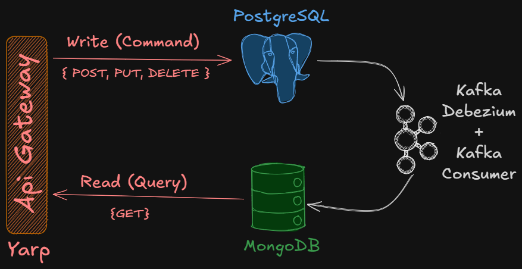

# CQRS Kafka Debezium Postgre Mongo CDC

**CQRS Command Query Responsibility Segregation (Komut Sorgu Sorumluluğu Ayrımı):** okuma ve yazma işlemlerini ayıran bir mimari desendir. Bu desen, sistemdeki karmaşıklığı azaltmak, performansı artırmak ve ölçeklenebilirliği iyileştirmek amacıyla kullanılır.

Eğer servis okuma yoğun ise, CQRS deseni kullanılarak okuma ve yazma işlemleri ayrı servislerde yönetilebilir. Bu sayede okuma işlemleri için optimize edilmiş bir veri deposu kullanılabilirken, yazma işlemleri için farklı bir veri deposu tercih edilebilir. Bu ayrım, her iki işlemin de performansını artırabilir ve sistemin genel verimliliğini iyileştirebilir.

Aşağıdaki görselden görüleceği üzere yoğun olan read işlemi, write işleminden bağımsız olarak scale edilebilir hale gelmiş olur.



**Kafka Debezium:** veri tabanı değişikliklerini izlemek için kullanılan bir araçtır. Bu sayede uygulamalar veri tabanındaki değişiklikleri gerçek zamanlı olarak takip edebilir. 

CDC (Change Data Capture), veritabanı değişikliklerini gerçek zamanlı olarak izlemek ve bu değişiklikleri başka sistemlere veya uygulamalara iletmek için kullanılan bir tekniktir. CDC, özellikle veri entegrasyonu, veri replikasyonu ve veri analitiği gibi alanlarda yaygın olarak kullanılır. Bu işlem için kullanılan db'nin CDC özelliğinin açılması gerekir. PostgreSQL'de CDC (Change Data Capture) kullanarak veri değişikliklerini izlemek için genellikle "logical replication" ve "wal2json" gibi araçlar kullanılır. Aşağıda, PostgreSQL'de CDC'yi etkinleştirmek ve kullanmak için docker-compose.yml dosyası postgre imajında yapılması gereken ayarlar:

```yaml
    commands:
      - "postgres"
      - "-c"
      - "wal_level=logical"
``` 

>Debezium, CDC'leri dinleyerek veritabanı değişikliklerini gerçek zamanlı olarak yakalar. Bir veritabanında yapılan değişiklikler önce veritabanının işlem günlüğüne (transaction log) kaydedilir. Debezium, bu işlem günlüğünü izler ve değişiklikleri algılar. Algılanan değişiklikler daha sonra bir mesaj kuyruğuna (örneğin Apache Kafka) gönderilir. Bu sayede, diğer uygulamalar veya mikroservisler bu değişiklikleri gerçek zamanlı olarak alabilir ve işleyebilir. Debezium, çeşitli veritabanları için destek sağlar ve bu sayede farklı veritabanları arasında veri senkronizasyonu ve entegrasyonu kolaylaştırır.

## Uygulama

Bu uygulama *Postman* ile bir *debezium* connector oluştur ve write-api ile gelen requestleri bir *PostgreSQL* tablosuna yazar. Debezium connector sayesinde tabloyu izler ve değişiklik olduğunda bunu *Kafka Topic'lerine* yazar. Bu topic'i consume eden servis datayı *Mongo* dokümanına yazar. Postman ile get request yapıldığında read-api çağırılır ve mongo dokümanından okuma yapılır.