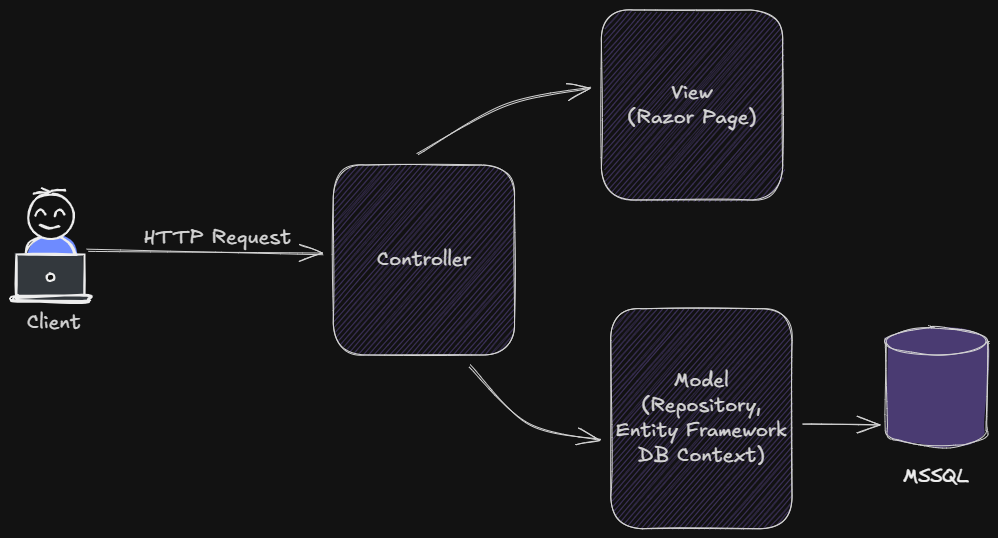

# Not Tutma Uygulaması (ASP.NET Core Web API + MVC)

Bu proje, **ASP.NET Core Web API ve MVC** kullanarak geliştirdiğim bir **not tutma uygulamasıdır**. 

---
### Backend (ASP.NET Core Web API)
- Minimal API yapısı ile **CRUD işlemleri** (Create, Read, Update, Delete) gerçekleştirme
- **Entity Framework Core** ile veri modeli oluşturma ve migration işlemleri
- **MS SQL Server** üzerinde veritabanı yönetimi
- API endpointlerini test etmek için **Postman** kullanımı
- Async/await ve dependency injection ile modern backend pratiklerini uygulama

### Frontend (ASP.NET Core MVC)
- MVC pattern ile **web uygulaması geliştirme**
- Web API'yi **consume ederek** client tarafında CRUD işlemleri gerçekleştirme
- Razor Views ile **form ve listeleme işlemleri**
- Model binding ve validation ile **güvenli veri girişleri**

---

## Proje Özellikleri
- **Not ekleme, listeleme, güncelleme ve silme** işlemleri
- API ve MVC client entegrasyonu
- EF Core migrations ile veritabanı yönetimi
- HttpClient kullanımı ile API çağrılarının yönetimi
- Model validation ile hatalı veri girişlerini engelleme

---

## Proje Yapısı
/NoteTakingApp
│
├─ Controllers/ # MVC controllerlar
├─ Models/ # Not ve veri modelleri
├─ Views/ # Razor view sayfaları
├─ Data/ # DbContext ve repository
├─ wwwroot/ # CSS, JS ve resimler
└─ Program.cs # Uygulama başlatma noktası
