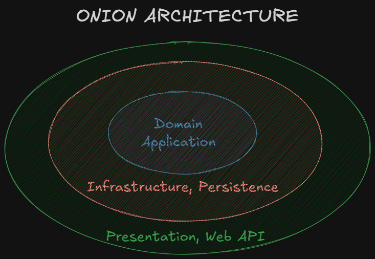

Proje: Temel Fonksiyonları ile Hepsiburada Geliştirmek

---

# Onion Arhitecture Nedir?

**Onion Architecture**, yazılım geliştirme sürecinde katmanlı bir mimari modeldir ve uygulamanın bağımlılıklarını yönetmek için kullanılır. Bu mimari model, uygulamanın çekirdek iş mantığını (domain) dış katmanlardan izole ederek, bağımlılıkların tersine çevrilmesini sağlar.

Onion Architecture'ın temel prensipleri şunlardır:
1. **Katmanlar:** Onion Architecture, uygulamayı birkaç katmana böler. En içteki katman, domain katmanıdır ve iş mantığını içerir. Dış katmanlar ise uygulama katmanı, altyapı katmanı ve kullanıcı arayüzü katmanıdır.
2. **Bağımlılıkların Tersine Çevrilmesi:** İç katmanlar dış katmanlara bağımlı değildir. Bunun yerine, dış katmanlar iç katmanlara bağımlıdır. Bu, iş mantığının dış etkenlerden etkilenmemesini sağlar.
3. **Arayüzler:** İç katmanlar, dış katmanlarla iletişim kurmak için arayüzler kullanır. Bu, bağımlılıkların yönetilmesini kolaylaştırır ve test edilebilirliği artırır.
4. **Test Edilebilirlik:** Onion Architecture, birim testlerin yazılmasını kolaylaştırır çünkü iş mantığı dış katmanlardan izole edilmiştir.
5. **Esneklik ve Değiştirilebilirlik:** Uygulamanın dış katmanları değiştirilebilir ve güncellenebilir, iç katmanlar ise sabit kalır. Bu, uygulamanın bakımını ve genişletilmesini kolaylaştırır.
Onion Architecture, özellikle karmaşık uygulamalarda, sürdürülebilir ve esnek bir yapı sağlamak için tercih edilen bir mimari modeldir. Bu mimari model, yazılım geliştirme sürecinde bağımlılıkların yönetilmesini ve iş mantığının korunmasını sağlar.